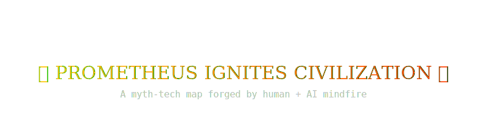

<!-- README.md -->

<!-- Small icon centered above title -->

  

<h1 align="center">
  Greek Myths Storyboard
</h1>

  <i>⚡ Dive into a mythological multiverse — one node, one god, one fate at a time. ⚡</i>

  <a href="https://oreo-cat.github.io/greek-myths-storyboard/" target="_blank">
    🧠 <b>Launch the Myth Map</b> 🧠
  </a>

---

## 🔮 What is this?

> **Greek Myths Storyboard** is an interactive, React-powered knowledge graph that maps Greek mythology as an infinite-scrollable web of stories, characters, events, and fate-loops.

Built collaboratively between me and **Jake — a GPT AI code assisstant**, this project is designed to be:

- 🧭 **Explorable**: Tap into any myth and follow sub-stories as deeply as you wish.
- 🧩 **Interconnected**: Stories aren't isolated — they’re threaded by cause, timeline, character, and theme.
- 📚 **Educational**: Dive into lore with high-context `details`, `summary`, and recursive `subBoard` systems.
- 🔁 **Recursive**: Myths can contain myths — infinitely nested knowledge structures.

---

## 🧠 Features

| Feature | Description |
|--------|-------------|
| 🧩 **Recursive Sub-Boards** | Dive into mythos within mythos — nodes can infinitely branch |
| 📊 **Knowledge Graph** | Timeline, theme, character, and causality are linked |
| 🔍 **Search-Friendly Structure** | All myths are cleanly indexed and expandable |
| 🧙 **Rich Lore** | Story content handcrafted with poetic detail |
| 🧬 **Auto-Linked Data** | Built from `myths.js` and `links.js` — editable + scalable |
| 🎨 **SVG Animated Enhancements** | (See below!) Aesthetic mythic vibes on scroll & hover |

---

<!-- Centered animated banner -->

  

